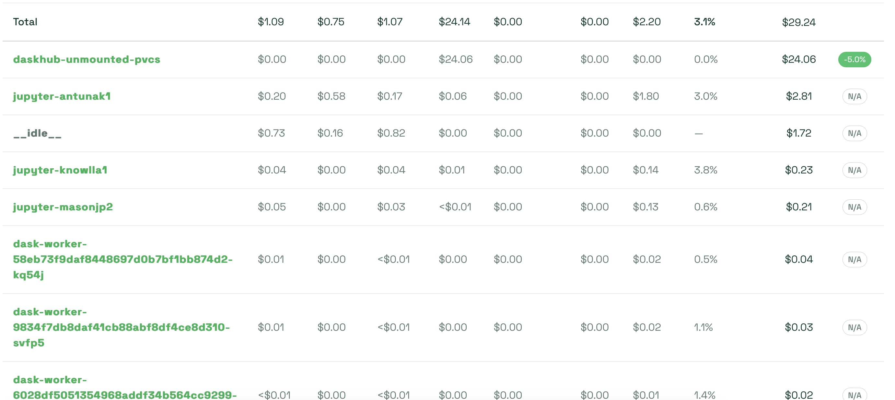

# HelioCloud Daskhub Cost Monitoring with Kubecost

HelioCloud employs the use of [Kubecost](https://github.com/kubecost) for monitoring the cost of the Daskhub Kubernetes cluster. This includes individual user jupyter servers as well as Daskjobs and their associated volume claims

## Configuring and Deployment

Kubecost can be deployed into a HelioCloud environment by setting `daskhub_metrics: True` in the deployment instance yaml file and configuring the following settings:

```
daskhub:
    monitoring:
        AWS_LOAD_BALANCER_SSL_CERT: "arn:aws:acm:(REGION):(ACCOUNT_ID):certificate/(CERT_ID)"
        grafana_domain_prefix: (grafana-prefix)
        cost_analyzer_domain_prefix: (kubecost-prefix)
```

`grafana_domain_prefix` and `cost_analyzer_domain_prefix` are the domain prefixes for the respective grafana and cost analyzer tools. Whatever is set here will be configured with AWS DNS Service - Route53.

Follow along a normal deployment and Kubecost (along with Grafana and Prometheus) will be deployed into the `monitoring` namespace in your kubernetes cluster.

## Getting there...

Once your cluster is up and running and the jupyterlab portal can be reached, navigate to the url for your Kubecost deployment: `(cost_analyzer_domain_prefix).(domain_url)`.

## Navigating Kubecost Main Page

*Authentication to Kubecost requires an account in the HelioCloud Cognito UserPool. See the HelioCloud `Auth` stack for more information on authorization.*

The main page for Kubecost contains relative information about the entire cluster it is deployed in.


### User Server Costs

To drill down into user costs, navigate to `Monitoring`, then `Allocations`:


### Allocations

`Allocations` contains information on all namespaces in the cluster. For user costs, we want to dive into `daskhub`, as that namespace is where user servers/pods live.


### Uncontrolled Workloads

The `daskhub` namespace is home to many controllers, we want to focus on `Uncontrolled Workloads`.


### Individual User/Job Costs

This filter has isolated pods that are associated with users. It includes both jupyter servers and dask jobs. Use the filters to drill down into specific days or view over a period of time.




To remove all dask jobs from the table, use the following filter to only display jupyter pods.


