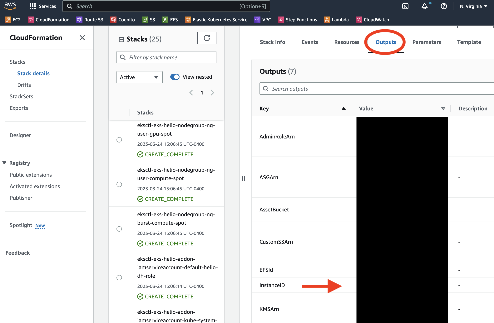
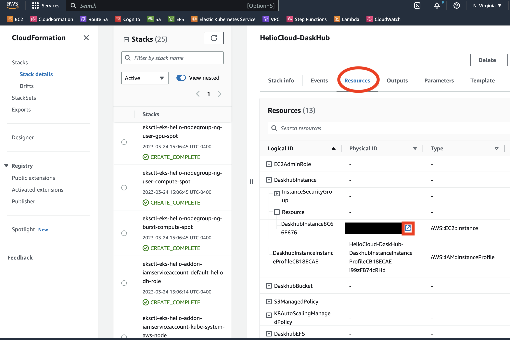
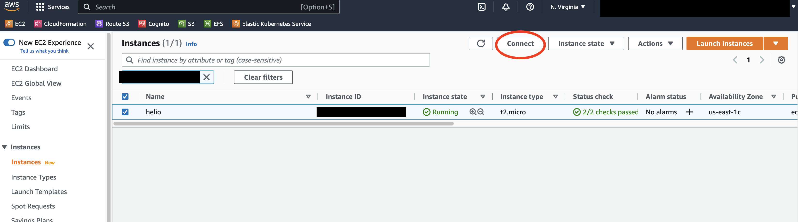
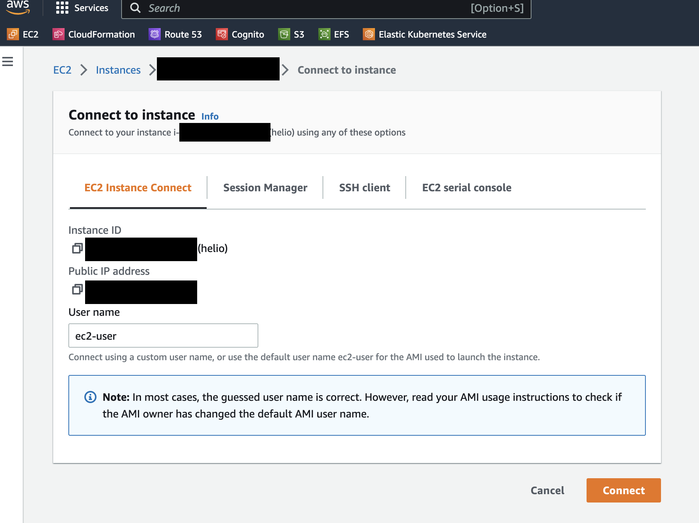
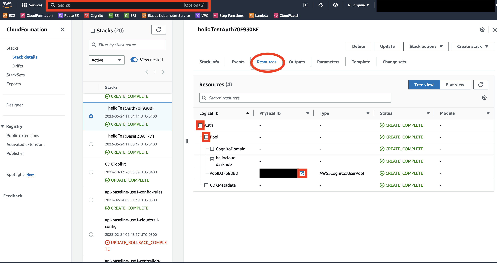
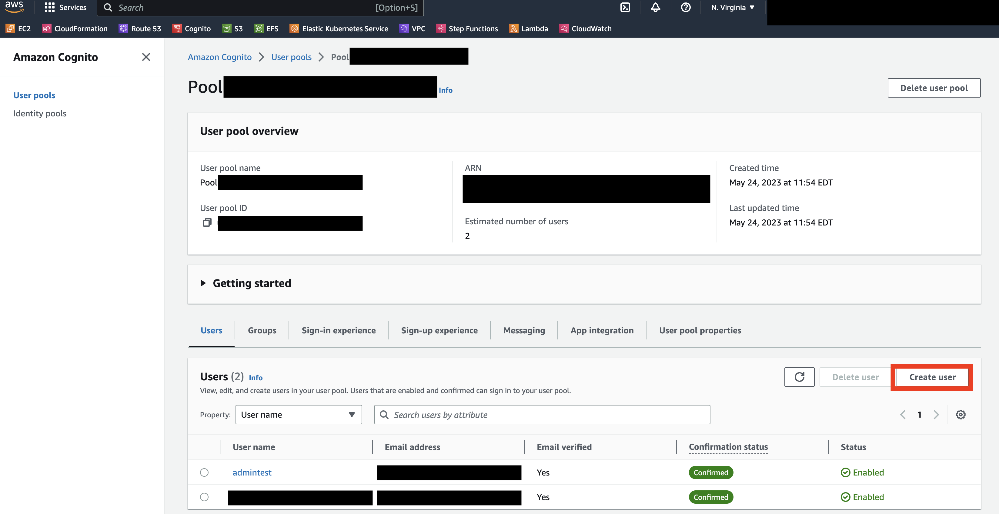
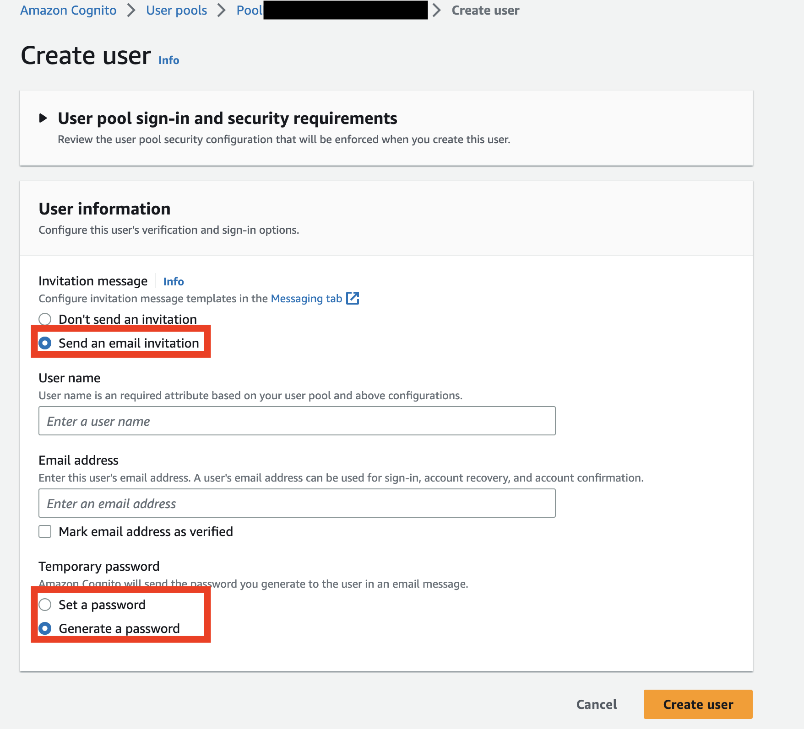

# HelioCloud DaskHub installation instructions
These are instructions about how to install the HelioCloud version of DaskHub in AWS.

- [HelioCloud DaskHub installation instructions](#heliocloud-daskhub-installation-instructions)
- [Installing Daskhub](#installing-daskhub)
  - [Requirements](#requirements)
  - [Initial infrastructure](#initial-infrastructure)
  - [Kubernetes Installation](#kubernetes-installation)
    - [Cluster (EKS) Configuration and Deployment](#cluster-eks-configuration-and-deployment)
    - [DaskHub Helm Deployment](#daskhub-helm-deployment)
  - [Log into Daskhub](#log-into-daskhub)
  - [Create Users](#create-users)
  - [OAuth Notes](#oauth-notes)
  - [Debugging](#debugging)
- [Updating Daskhub](#updating-daskhub)
  - [Updating Kubernetes Cluster](#updating-kubernetes-cluster)
- [Deleting Daskhub](#deleting-daskhub)
  - [Tearing down HelioCloud Daskhub infrastructure](#tearing-down-heliocloud-daskhub-infrastructure)
- [Notes](#notes)
  - [Things that persist](#things-that-persist)

# Installing Daskhub
## Requirements
Must be able to deploy AWS CDK projects and we recommend but do not require that you have the SSM client set up.


## Initial infrastructure

We will setup an admin machine (an EC2 instance) and other infrastructure via AWS CDK (we assume this has been done in accordance with the HelioCloud framework install). This admin machine is where we run the Kubernetes install and interact with the Daskhub. 

1. Deploy Daskhub through CDK (instructions [here](../README.md))
   - Ensure that the DaskHub is being deployed as part of your HelioCloud instance by setting `enabled.daskhub` to `True`
in your instance configuration file stored at `instance/name_of_instance.yaml`(see [the example instance configuration file for details](../instance/example.yaml))
1. SSM into EC2 instance either through the AWS CLI command line (recommended method) or using AWS Console EC2 Instance Connect


   - <details><summary>Through SSM</summary><blockquote>
  
     - In order to SSM you must have both the [AWS CLI](https://aws.amazon.com/cli/) and the [Session Manager plugin](https://docs.aws.amazon.com/systems-manager/latest/userguide/session-manager-working-with-install-plugin.html) installed 
      - Find `<INSERT_EC2_INSTANCE>` by looking at output from your CDK deployment terminal (labeled as `HelioCloud-Daskhub.InstanceID`) or in the AWS Console under CloudFormation, it is under the stack's output under PublicDNS
        - 
  
      - Run the following command within a local terminal (uses default AWS credentials set up with `aws configure`):
        ~~~~
        aws ssm start-session --target <INSERT_EC2_INSTANCE>
        ~~~~
      - NOTE: if you receive CERTIFICATE_VERIFY_FAILED errors, you can optionally use the `no-ssl-verify` flag (though this is not recommended)

      </blockquote></details>
   - <details><summary>Through Instance Connect</summary><blockquote>
  
      - Find the EC2 instance in the Cloudformation stack resources, can click the highlighted launch button to jump to the instance 
         
      - Select the EC2 instance and click the Connect button
         
      - Start connection to be connected through SSH in browser
        
      </blockquote></details>

## Kubernetes Installation

### Cluster (EKS) Configuration and Deployment
3. Move to home directory (either with `cd` or `cd ~`) and alter configuration file `app.config`
    - Assumes that Daskhub will be deployed to a DNS that is linked in AWS Route 53. Can deploy if this is not the case but these instructions do not support alternative methods.  
    - Can alter the following variables (`NAMESPACE` - the kubernetes namespace to deploy application to - and `EKS_NAME` - the name of the AWS Elastic Kubernetes Service we are deploying that must be unique: must only be alphanumeric or hyphen characters) at top of file if they already exist or don't reflect your name choice. Generally can leave these if there are no other HelioCloud DaskHubs deployed in the same region
    - Can alter the HelioCloud docker container to use (assumes location is available publicly)
    - ROUTE53_HOSTED_ZONE is whatever zone is set up in AWS for you to use, e.g. at APL it is aplscicloud.org. If you do not have a Route 53 Hosted Zone see [instructions](https://docs.aws.amazon.com/Route53/latest/DeveloperGuide/CreatingHostedZone.html).
    - ADMIN_USER_EMAIL should be yourself or the assigned admin


You can keep many of the items filled in app.config as long as another Daskhub is not up in the same region.

NOTE: EKS deployment can take 20+ minutes.

1. Setup and deploy Kubernetes (K8s) on EC2 machine
    - Can alter nodeGroups and managaedNodeGroups in `cluster-config.yaml.template` to suit your cluster (default has master and nodes where uses have spot nodes and users have 3 types of nodes - high compute user, high GPU user, and high compute burst)
    - Execute `01-deploy-k8s.sh` by running `./01-deploy-k8s.sh`
        - May fail if region deploying in does not have those instance types, can modify the `cluster-config.yaml.template` file to remove or replace instance types that are available in region and rerun script 
        - TODO do the following in a verification script and throw error if not working
        - (Optional) If you wish to check, you can ensure persistent volumes are created by running `kubectl get pv` and `kubectl get pvc --namespace <NAMESPACE>`
        - (Optional) Can ensure autoscaling set by running `kubectl get deployments --namespace kube-system`
   	- Can take 10 minutes or more to execute
   	- If you are getting 'Error from server (NotFound)' or similar errors, wait and try again later.
   	- Script is safe to re-run if fails.

### DaskHub Helm Deployment

**Daskhub (and JupyterHub) can be set-up so that there is no authentication.  We do NOT recommend this as this will leave a public facing entrypoint to your AWS instance where malicious users can access your Daskhub**.  The current HelioCloud DaskHub configuration is set-up for authentication (but can be run without).  If users standup DaskHubs without authentication (ex. for testing), we recommend tearing it down immediately after debugging is complete or then deploying with authentication right after.

This deployment assumes that Daskhub uses AWS Cognito for Authentication and Authorization that is initialized in step 1.  Other methods of Authentication and Authorization can be used but we do not detail them here. We also assume that the user wants domain routing to a DNS address purchased and available in AWS Route 53.  This is so the DaskHub can be accessed from a human readable URL.  We assume the user wants the DaskHub to sit on a subdomain of the DNS address that is configured in step 3.

See more details on [DNS routing](https://saturncloud.io/blog/jupyterhub_security/) and [https](https://zero-to-jupyterhub.readthedocs.io/en/latest/administrator/security.html#set-up-automatic-https).


5. Execute `02-deploy-daskhub.sh` by running `./02-deploy-daskhub.sh`
    - This script generates copies and fills in configurable values of 3 Daskhub configuration files (can alter manually if have alternate configurations, but NOTE if you change the .yaml files they will be overwritten when these are copied from the .yaml.template files):
        <details>
        <summary>dh-config.yaml </summary>

        - this file contains the specifications of our exact Daskhub build and we will modify the template file as we perform updates.  This file assumes you have built K8s as above specifically the EFS and serviceaccount naming conventions (if this is not the case alter these sections)
        -  Only need to adjust `dh-config.yaml` if you did not follow the standard deployment instructions
        -  If need to alter the docker container make sure to do it in the `app.config`

        </details>

        <details>
        <summary>dh-secrets.yaml</summary>

        - this file contains randomly generated API keys for JupyterHub and DaskHub, if you have specific API keys replace those instead
        -  Only need to adjust `dh-secrets.yaml` if you want to specify your own API keys for Daskhub

        </details>

        <details>
        <summary>dh-auth.yaml</summary>

        - this file contains authentication components of the Daskhub.  This is optional but highly recommended and done by default in this set-up. 

        </details>
    - This will use Helm (a K8s package manager) to get Daskhub running on our cluster, and as such you need to ensure that at least one node is available.
    - Default deploys with Authentication and Authorization then gets the URL for our DNS routing and reruns with Authentication and Authorization specified in `dh-auth.yaml`, can alter `02-deploy-daskhub.sh` according to comments to run without authentication
    - If you receive an error on executing the helm chart see this [link](https://stackoverflow.com/questions/72126048/circleci-message-error-exec-plugin-invalid-apiversion-client-authentication)
    - Can take 10 minutes or more to execute
    - If you are getting 'Error from server (NotFound)' or similar errors, wait and try again later.
    - Script is safe to rerun if fails.

## Log into Daskhub

6. Go to the Daskhub Frontend URL you just configured and try logging in. (NOTE: sometimes it can take up to 5 minutes for the DNS to propagate).  If you try to load too early on Google Chrome it seems to not try to resync for several minutes (try alternate browser).

  - The URL is defined in app.config (`<ROUTE53_DASKHUB_PREFIX>.<ROUTE53_HOSTED_ZONE>`), default is `daskhub.<ROUTE53_HOSTED_ZONE>`.
   - If this does not work after waiting up to 5 minutes for the changes to propagate through try running: 
     - `helm upgrade daskhub dask/daskhub --namespace=<NAMESPACE> --values=dh-config.yaml --values=dh-secrets.yaml --version=2022.8.2 --install` 
     - Then check that the daskhub is working without auth by running `kubectl --namespace=<NAMESPACE> get svc proxy-public` and go to the `EXTERNAL-IP` url to make sure it loads (this allows you to spin up a Jupyterhub without authentication and you can type anything into the username and password) 
     - Then run `helm upgrade daskhub dask/daskhub --namespace=<NAMESPACE> --values=dh-config.yaml --values=dh-secrets.yaml --values=dh-auth.yaml --version=2022.8.2 --install` and try the link again.  Sometimes it takes a few deploys.

Congratulations! At this point you should have a working HelioCloud DaskHub environment. The following section will outline how you can create authorized users within the Daskhub.

## Create Users

If you are using AWS Cognito (our default configuration) you will have to create users for the Daskhub via the AWS Web Console or similar (e.g. AWS CLI).  
   - First find the relevant AWS Cognito User Pool
     - Log into the AWS Console
     - Find the CloudFormation Auth deployment associated with your HelioCloud instance by first going searchinging `CloudFormation` in the search bar, then select the the Auth stack associated by your instance (ex. `<instance_name>AUTH####`) and select the resources, find the associated User Pool and click on the arrow to link you to the Cognito User Pool 
   - Once at the Cognito User Pool, click `Create User`
   
   - Make an admin account that uses the same admin name as given in `app.config` (e.g. `admintest`).  Be sure to click `Invitation message: send an email invitation` if you use `generate a password` or it will not tell you what password it generated (or you can set your own password).
     - 
   - (Optional) Make non-admin user account for testing or to populate your users' accounts

## OAuth Notes

OAuth is controlled by your institution's authorization method (AWS Cognito is described in this document) and used by JupyterHub under the hood.  The oauth access token will persist based on your authorization setup.  The default in AWS Cognito is 60 minutes.  This means that if you logout of the Daskhub and then click sign in it will auto login and bypass the login page if the token has not expired.  This is NOT a security issue, the token is behaving as set-up.  This does however mean that users cannot easily logout and have another user login on their same browser.  Institutions may adjust the token time of life in their own authorization tool per their needs.

NOTE: AWS session tokens expire but have a long expiration time. If you are trying to log in as more than 1 user (for testing), you may have to use a different browser session to avoid token clashes blocking the login.

## Debugging
Some debugging tips in no particular order. NOTE: the default `NAMESPACE` in `app.config` is `daskhub`

- Check logs
  - Can check pod logs by first finding pod name using `kubectl -n <NAMESPACE> get pods` and then `kubectl -n <NAMESPACE> logs <POD_NAME>` with the appropriate pod name

- Restart pod by killing it
    - Can kill a pod and it will restart `kubectl -n <NAMESPACE> delete pod <POD_NAME>`

- Check helm configuration
    - Can examine if helm configuration files are not being parsed properly by adding `--dry-run --debug` to helm command, can also save to output file.  
    - Example:
    `helm upgrade daskhub dask/daskhub --namespace=<NAMESPACE> --values=dh-config.yaml --values=dh-secrets.yaml --values=dh-auth.yaml --version=2022.8.2 --install --dry-run --debug > test.out`

- Check event stack
    - It can be helpful to look at the event stack for your pods using:
        `kubectl -n <NAMESPACE> get events --sort-by='{.lastTimestamp}'`

- Turn on jupyterhub debugging
    - You can also turn on `debugging` in jupyterhub. Edit the `dh-config.yaml` file so that:
    ~~~
    jupyterhub:
    debug:
        enabled: true
    ~~~

- Check AWS regional availability
    - Image pull problems can be related to regional availability. Use the following command to verify availability for your region:
      - `aws ec2 describe-instance-type-offerings --location-type availability-zone  --filters Name=instance-type,Values=c5.xlarge --region us-east-1 --output table`

- Force node to scale up
    -  `eksctl scale nodegroup --cluster <CLUSTER_NAME> --name=ng-user-compute-spot --nodes-min=1` where <CLUSTER_NAME> is set by default to `eks-helio` in `app.config`

# Updating Daskhub

To update Daskhub you can alter any of the configuration files (NOTE: not the ones with the suffix .template) and then run `helm upgrade daskhub dask/daskhub --namespace=<NAMESPACE> --values=dh-config.yaml --values=dh-secrets.yaml --values=dh-auth.yaml --version=2022.8.2 --install`

NOTE: often changes can take a minute or two to propogate through the system.

## Updating Kubernetes Cluster

1. Find nodes
   -  To list the worker nodes registered to the Amazon EKS control plane, run the following command:
      - `eksctl get nodegroup --cluster <clusterName>` where <CLUSTER_NAME> is set by default to `eks-helio` in `app.config`.  The following is an example output

        ```
        [centos@ip-172-31-90-70 ~]$ eksctl get nodegroup --cluster <clusterName>
        CLUSTER		NODEGROUP		STATUS		CREATED			MIN SIZE	MAX SIZE	DESIRED CAPACITY	INSTANCE TYPE	IMAGE ID		ASG NAME		TYPE
        eks-helio	ng-burst-compute-spot	CREATE_COMPLETE	2022-10-11T16:19:55Z	0		10		0			m5.8xlarge	ami-099c768b04001b983	eksctl-eks-helio-nodegroup-ng-burst-compute-spot-NodeGroup-1CBEMPEXLSKOS	unmanaged
        eks-helio	ng-daskhub-services	ACTIVE		2022-10-11T16:20:28Z	1		1		1			t3a.medium	AL2_x86_64		eks-ng-daskhub-services-98c1e3ec-7689-7a38-830d-011e2be4cbc6			managed
        eks-helio	ng-user-compute-spot	CREATE_COMPLETE	2022-10-11T16:19:55Z	0		15		0			m5.xlarge	ami-099c768b04001b983	eksctl-eks-helio-nodegroup-ng-user-compute-spot-NodeGroup-1B379X9Q74QA9		unmanaged
        eks-helio	ng-user-gpu-spot	CREATE_COMPLETE	2022-10-11T16:19:55Z	0		5		0			g4dn.xlarge	ami-0cb17a7e952cabb92	eksctl-eks-helio-nodegroup-ng-user-gpu-spot-NodeGroup-1E03TASV0OF6E		unmanaged
        ```
2. Drain nodes
   - Drain each node using `eksctl drain nodegroup --cluster=<CLUSTER_NAME> --name=<NODE_GROUP_NAME> `
      - Ex. `eksctl drain nodegroup --cluster <CLUSTER_NAME> --name ng-user-compute-spot`
3. Delete nodes
   - DO NOT DELETE managed node (`ng-daskhub-services`)
   - Can delete each node using `eksctl delete nodegroup --cluster=<CLUSTER_NAME> --name=<NODE_GROUP_NAME>`

NOTE: If you get a FAIL from any above commands, you may want to go to AWS console to CloudFormation and look at stack status. Make sure all stacks are successfully deleted, then trigger a delete from the console for the stack in question

1. Stop managed node
   - `eksctl scale nodegroup --cluster=<CLUSTER_NAME> --name=<NODE_GROUP_NAME> --nodes-min 0`

2. Upgrade cluster through AWS Console
   - Search for EKS in the AWS toolbar
   - Select 'upgrade' on the cluster (as needed)

3. Update tooling
   - Execute `00-tools.sh` on EC2 instance

4. Rebuild nodegroups
   - Alter version in `cluster-config.yaml` files so the yaml version matches version changed to in EKS AWS Console
   - `eksctl upgrade cluster --config-file cluster-config.yaml`

5. Update helm chart  
   - `helm install --version 2022.8.2 myrelease dask/dask`
   - OPTIONAL NOTE: IF you do 'helm repo update' you get a later version of daskhub `helm repo update`

6. Update the `dh-config.yaml` file to use latest container (TODO make this configurable and in `app.config`)
   
7.  Run helm
    - `helm upgrade daskhub dask/daskhub --namespace=<NAMESPACE> --values=dh-config.yaml --values=dh-secrets.yaml --values=dh-auth.yaml --version=2022.8.2 --install --debug`

8.  Find and kill 'autohttps' pod
    - List the pods `kubectl --namespace=<NAMESPACE> get pod`
    - Identify 'autohttps'
        ```
        NAME                                              READY   STATUS    RESTARTS   AGE
        api-daskhub-dask-gateway-777666cfc7-dn6cx         1/1     Running   0          46m
        autohttps-9f776485c-vpncw                         2/2     Running   0          46m
        continuous-image-puller-49xxz                     1/1     Running   0          4m36s
        controller-daskhub-dask-gateway-b465c66df-jmjxl   1/1     Running   0          46m
        hub-6ffd77f4-hzzj6                                1/1     Running   0          4m34s
        proxy-75b958f4f4-q8j9t                            1/1     Running   0          4m35s
        traefik-daskhub-dask-gateway-6d6b6479c8-6drdw     1/1     Running   0          4m36s
        user-scheduler-698cd85687-jnm7h                   1/1     Running   0          46m
        user-scheduler-698cd85687-vzc2r                   1/1     Running   0          45m
        ```
    - Kill autohttps pod (it will auto-restart)
      - `kubectl -n <NAMESPACE> delete pod <POD_NAME>`
    - Verify it restarts

IF THINGS GO WRONG: try the following to help debug
`kubectl -n <NAMESPACE> get events --sort-by='{.lastTimestamp}'`


# Deleting Daskhub

In order to delete Daskhub from the Kubernetes need to follow instructions (uninstall helm) here where the namespace from these instructions is "daskhub":
https://phoenixnap.com/kb/helm-delete-deployment-namespace

If used the instructions above can call `helm uninstall daskhub --namespace <NAMESPACE>` to remove daskhub


## Tearing down HelioCloud Daskhub infrastructure
1. Execute `99-delete-daskhub.sh` by running `./99-delete-daskhub.sh`
   - Uninstalls the helm chart, detaches the EFS mount, and tears down the Kubernetes cluster
   - If any failures can look in the AWS console for further debugging, most common failure is the EFS mounted target is still present and using the EKS VPC so the cluster is taken down (which will show cluster delete complete) but the cloudformation stack is still up with the VPC.  If this is the case, go into EFS > network and delete the troublesome mounted target.  Another issue may be that there is an existing Elastic Network Interface still up can go find these through EC2 > Network Interfaces
   - Note that some resources will persist and if you truly want them deleted you will need to delete them by hand (their retention policy is set to not delete by default). See [list of AWS resources](#things-that-persist) that persist.
2. Tear down the HelioCloud install Daskhub stack by calling `cdk destroy -c config=<CONFIGURING_FILE> HelioCloud-DaskHub` in your local terminal in the same way you deploy your cdk install

Make sure resources no longer exist before proceeding to next step as this can cause the infrastructure to get stuck in a dependency loop and require extensive troubleshooting.

# Notes

## Things that persist
- EFS
- Persistent volume in EBS (under EC2)
- KMS
- S3 bucket