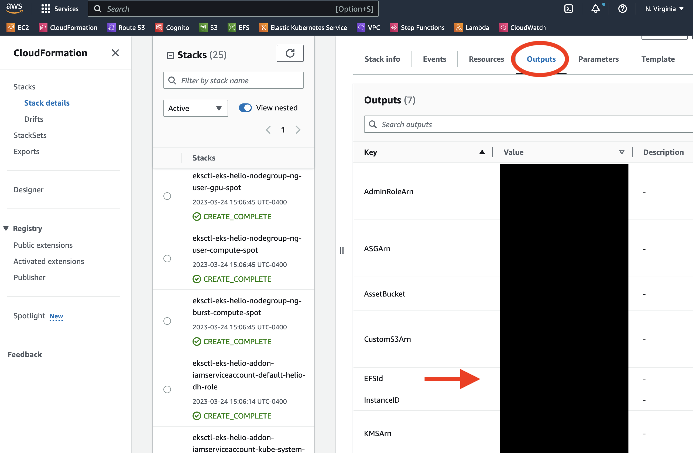
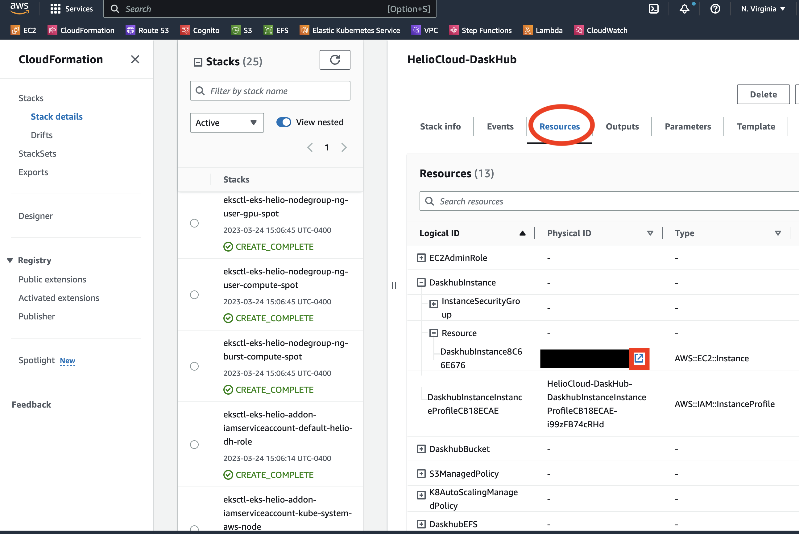
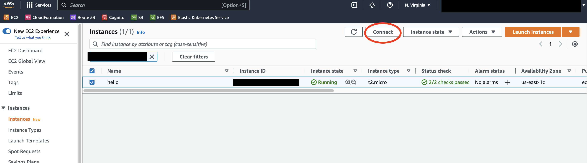
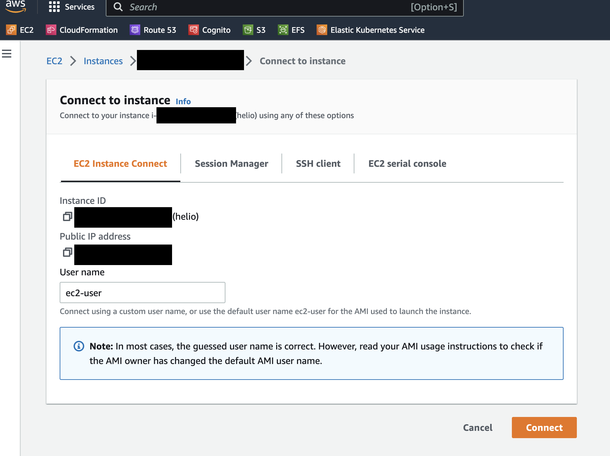
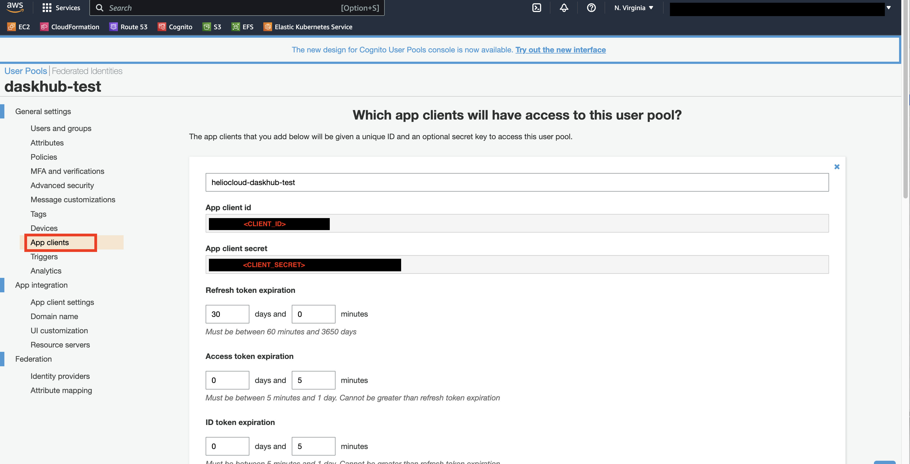
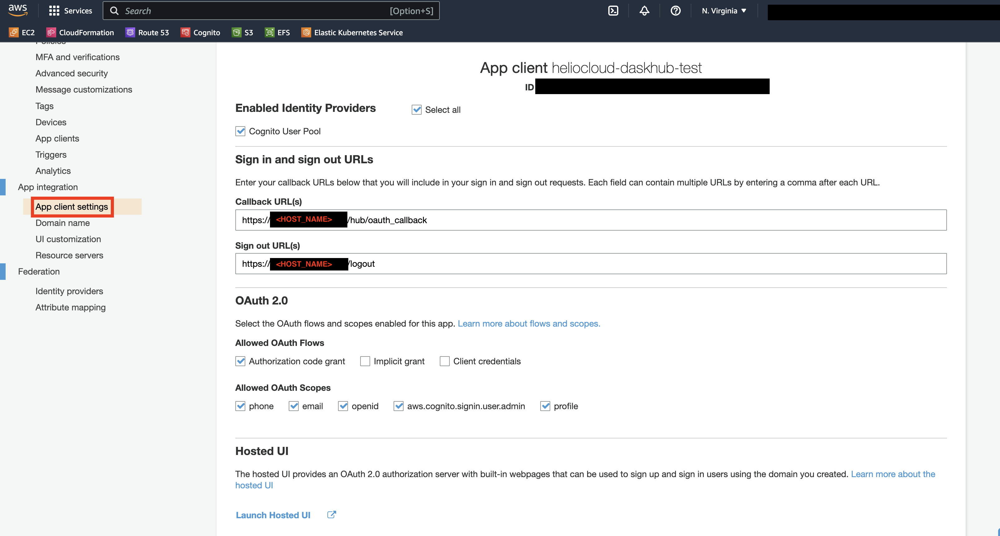
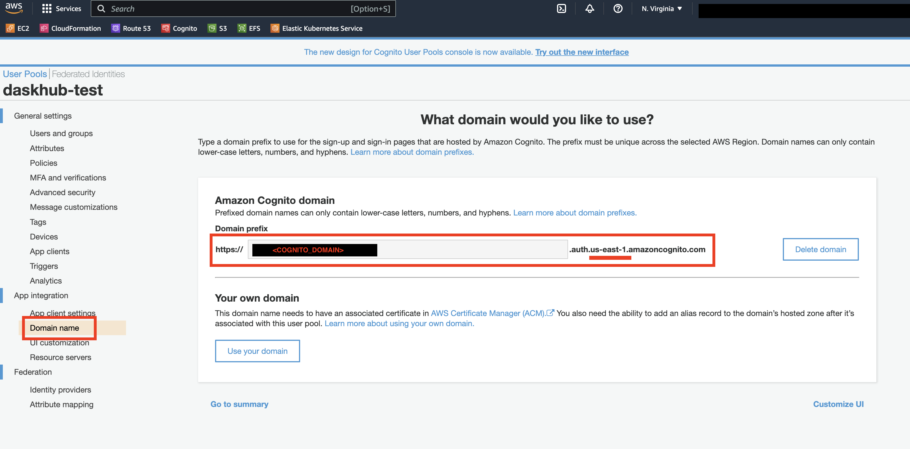

# HelioCloud DaskHub installation instructions
These are instructions about how to install the HelioCloud version of DaskHub in AWS.

- [HelioCloud DaskHub installation instructions](#heliocloud-daskhub-installation-instructions)
- [Installing Daskhub](#installing-daskhub)
  - [Requirements](#requirements)
  - [Initial infrastructure](#initial-infrastructure)
  - [Kubernetes Installation](#kubernetes-installation)
    - [Cluster (EKS) and Supporting Service (EFS, S3) Configuration and Deployment](#cluster-eks-and-supporting-service-efs-s3-configuration-and-deployment)
    - [DaskHub Deployment](#daskhub-deployment)
    - [(Optional but recommended) Set up Authentication and Authorization](#optional-but-recommended-set-up-authentication-and-authorization)
    - [AWS Cognito](#aws-cognito)
      - [(Optional but recommended) Domain Routing](#optional-but-recommended-domain-routing)
  - [Debugging](#debugging)
- [Updating Daskhub](#updating-daskhub)
  - [Updating Kubernetes Cluster](#updating-kubernetes-cluster)
- [Deleting Daskhub](#deleting-daskhub)
  - [Tearing down HelioCloud Daskhub infrastructure](#tearing-down-heliocloud-daskhub-infrastructure)
- [Notes](#notes)
  - [OAuth Auto Login](#oauth-auto-login)

# Installing Daskhub
## Requirements
Must have access to AWS environment with permissions that allow you to create/modify/delete IAM roles and AWS resources (verify that you have these permissions before beginning).  Our development roles are set such that our policy is:

- <details><summary>IAM Policy</summary><blockquote>
  
    ~~~
    {
        "Version": "2012-10-17",
        "Statement": [
            {
                "Effect": "Allow",
                "NotAction": [
                    "iam:*",
                    "organizations:*",
                    "account:*"
                ],
                "Resource": "*"
            },
            {
                "Effect": "Allow",
                "Action": [
                    "iam:List*",
                    "iam:Get*",
                    "iam:Tag*",
                    "iam:Attach*",
                    "iam:Detach*",
                    "iam:Put*"
                ],
                "Resource": "*"
            },
            {
                "Effect": "Allow",
                "Action": [
                    "iam:CreateServiceLinkedRole",
                    "iam:DeleteServiceLinkedRole",
                    "iam:ListInstanceProfilesForRole",
                    "organizations:DescribeOrganization",
                    "account:ListRegions"
                ],
                "Resource": "*"
            },
            {
                "Effect": "Allow",
                "Action": [
                    "iam:CreatePolicy",
                    "iam:CreatePolicyVersion",
                    "iam:CreateRole",
                    "iam:DeleteRole",
                    "iam:CreateInstanceProfile",
                    "iam:AddRoleToInstanceProfile",
                    "iam:PassRole",
                    "iam:RemoveRoleFromInstanceProfile",
                    "iam:DeleteAccountPasswordPolicy",
                    "iam:DeleteGroupPolicy",
                    "iam:DeletePolicy",
                    "iam:DeletePolicyVersion",
                    "iam:DeleteRolePermissionsBoundary",
                    "iam:DeleteRolePolicy",
                    "iam:DeleteUserPermissionsBoundary",
                    "iam:DeleteUserPolicy",
                    "iam:DeleteInstanceProfile",
                    "iam:UpdateAssumeRolePolicy"
                ],
                "Resource": "*"
            }
        ]
    }
    ~~~
   </blockquote></details>
This is a very open role and not necessarily what you should set for your default user.  However, in order to run these instructions must have IAM roles that allow creation/deletion of both IAM roles and policies.

Also require that can deploy CDK projects (TODO describe how to do that) and we recommend but do not require that you have the SSM client setup (TODO describe how to do that)


## Initial infrastructure

Choose a region within AWS to deploy infrastructure (suggestion is `us-east-1` as the data for initial HelioClouds are here and there will be no egress of data).

We will setup an admin machine (an EC2 instance) and other infrastructure via AWS CDK (we assume this has been done in accordance with the HelioCloud install). This admin machine is where we run the Kubernetes install and interact with the Daskhub and does not do heavy lifting so a small instance is sufficient (t2.micro). 

1. Deploy Daskhub through CDK (instructions [here](https://git.mysmce.com/heliocloud/heliocloud-services/-/tree/develop/install))
2. SSM into EC2 instance either through command line or using AWS Console EC2 Instance Connect
   - <details><summary>Through SSM</summary><blockquote>
  
        ~~~~
        aws ssm start-session --target <INSERT_EC2_INSTANCE>
        ~~~~
    
      - In order to SSM you must have both the [AWS CLI](https://aws.amazon.com/cli/) and the [Session Manager plugin](https://docs.aws.amazon.com/systems-manager/latest/userguide/session-manager-working-with-install-plugin.html) installed 
      - Can find `<INSERT_EC2_INSTANCE>` by looking at output from CDK terminal (labeled as `HelioCloud-Daskhub.InstanceID`) or in the AWS Console under CloudFormation, it is under the stack's output under PublicDNS
        - 
      </blockquote></details>
   - <details><summary>Through Instance Connect</summary><blockquote>
  
      - Find the EC2 instance in the Cloudformation stack resources, can click the highlighted launch button to jump to the instance 
         
      - Select the EC2 instance and click the Connect button
         
      - Start connection to be connected through SSH in browser
        
      </blockquote></details>
3. Once connected to the EC2 instance, run the following commands `cd` and `sudo chown -R ssm-user:ssm-user /home/ssm-user`
      - This gives permissions to your login user role to modify the user folder

## Kubernetes Installation

### Cluster (EKS) and Supporting Service (EFS, S3) Configuration and Deployment

4. Setup and deploy Kubernetes (K8s) on EC2 machine and copy Daskhub config templates
    - Must have followed the permissions steps above and be in the `/home/ssm-user` folder (this should be defaulted to when you call `cd` or `cd ~`)
    - Can alter nodeGroups and managaedNodeGroups in `cluster-config.yaml.template` to suit your cluster (default has master and nodes where uses have spot nodes and users have 3 types of nodes - high compute user, high GPU user, and high compute burst)
    - Execute `02-deploy-k8s.sh` by running `./02-deploy-k8s.sh`
        - May fail if region deploying in does not have those instance types, can modify the `cluster-config.yaml.template` file to remove or replace instance types that are available in region and rerun script 
        - Can alter the following variables (`NAMESPACE` - the kubernetes namespace to deploy application to - and `EKS_NAME` - the name of the AWS Elastic Kubernetes Service we are deploying) at top of file if they already exist or don't reflect your name choice
        - Can ensure persistent volumes are created by running `kubectl get pv` and `kubectl get pvc --namespace daskhub`
        - Can ensure autoscaling set by running `kubectl get deployments --namespace kube-system`
    - This script also generates copies of 3 Daskhub configuration files
        - `dh-config.yaml` - this file contains the specifications of our exact Daskhub build and we will modify the template file as we perform updates.  This file assumes you have built K8s as above specifically the EFS and serviceaccount naming conventions (if this is not the case alter these sections)
        - `dh-secrets.yaml` - this file contains randomly generated API keys for JupyterHub and DaskHub, if you have specific API keys replace those instead
        - `dh-auth.yaml` - this file contains authentication components of the Daskhub.  This is optional but highly recommended (do this as soon as possible!).  Must replace all values that contain `<INSERT_******>`  and see comments for any other changes. NOTE: you can set this up right away if you've set up AWS Cognito (see [AWS Cognito section](#aws-cognito)) and have an external domain, if not you will have to update the Daskhub after deploying without authentication

### DaskHub Deployment

https://saturncloud.io/blog/jupyterhub_security/

**Daskhub (and JupyterHub) can be set-up so that there is no authentication.  We do NOT recommend this as this will leave a public facing entrypoint to your AWS instance where malicious users can access your Daskhub**.  The current DaskHub configuration does not force authentication.  Users can standup DaskHubs using this configuration file for testing but we recommend tearing it down immediately after debugging is complete.

See [AWS Cognito section](#aws-cognito) to set-up authentication through AWS. Also see https://saturncloud.io/blog/jupyterhub_security/ for detailed information about setting up DNS routing for DaskHub.

5. Alter Daskhub configuration files
    -  Only need to adjust `dh-config.yaml` if you did not follow the standard deployment instructions
    -  Only need to adjust `dh-secrets.yaml` if you want specific API keys for Daskhub
    -  Must alter `dh-auth.yaml` if you want Daskhub to have an authenticated sign-in (HIGHLY RECOMMENDED)
       -  Template shows how to configure authentication through AWS Cognito see [here] (https://z2jh.jupyter.org/en/latest/administrator/authentication.html) for alternative authentication options
               - Edit the following commented out sections of "dh-config.yaml" 
               -  The `jupyterhub.hub.GenericOAuthenticator.client_id` and `jupyterhub.hub.GenericOAuthenticator.client_secret` can be found in AWS Cognito App clients
                   -  
               -   `oauth_callback_url` needs to be `https://<INSERT_HOST_NAME>/hub/oauth_callback` for the callback URL using your own hosted domain. Change `jupyterhub.hub.GenericOAuthenticator.scope` to match AWS Cognito App client settings
                   -  
               -  The `jupyterhub.hub.GenericOAuthenticator.authorize_url`, `jupyterhub.hub.GenericOAuthenticator.token_url`, and `jupyterhub.hub.GenericOAuthenticator.userdata_url` need to be changed so the front part of the url aligns with what is specified in AWS Cognito Domain name.  

                   - 

               - For more details about HTTPS see [details](https://zero-to-jupyterhub.readthedocs.io/en/latest/administrator/security.html#set-up-automatic-https)
               - Example of populated `dh-auth.yaml`:
               ``` yaml
               jupyterhub:
                   hub:
                       config:
                       Authenticator:
                           auto_login: true
                       GenericOAuthenticator:
                           admin_users:
                           - admin1@institution.org
                           - admin2@test.com
                           login_service: "AWS Cognito"
                           client_id: 111111111
                           client_secret: 123456789101112
                           oauth_callback_url: https://hub.mydomain.org/hub/oauth_callback
                           authorize_url: https://domain-test.auth.us-east-1.amazoncognito.com/oauth2/authorize
                           token_url: https://domain-test.auth.us-east-1.amazoncognito.com/oauth2/token
                           userdata_url: https://domain-test.auth.us-east-1.amazoncognito.com/oauth2/userInfo
                           scope:
                           - openid
                           - phone
                           - profile
                           - email
                       JupyterHub:
                           authenticator_class: generic-oauth
                   proxy:
                       https:
                       enabled: true
                       hosts:
                           - hub.mydomain.org
                       letsencrypt:
                           contactEmail: admin2@test.com
               ```  


6. Deploy the Daskhub helm chart
    - This will use Helm (a K8s package manager) to get Daskhub running on our cluster
    - Run `helm upgrade daskhub dask/daskhub --namespace=daskhub --values=dh-config.yaml --values=dh-secrets.yaml --version=2022.8.2 --install `
      - If you have all AWS Cognito setup,an external domain, and have altered `dh-auth.yaml` accordingly (see priot step) then you can instead run `helm upgrade daskhub dask/daskhub --namespace=daskhub --values=dh-config.yaml --values=dh-secrets.yaml --values=dh-auth.yaml --version=2022.8.2 --install` 
      - If you receive an error on this execute see this [link](https://stackoverflow.com/questions/72126048/circleci-message-error-exec-plugin-invalid-apiversion-client-authentication)

7. Get Daskhub LoadBalancer url
    - Get URL to access Daskhub
    - Run `kubectl --namespace=daskhub get svc proxy-public`
      - May need to wait until pods are full spun up, can check if they are in a ready state with `kubectl --namespace=daskhub get pod`
    - Enter url into web browser to ensure it is accessible (may take a few minutes even if the pods are in ready state)


### (Optional but recommended) Set up Authentication and Authorization
### AWS Cognito

Optional but recommended (our Daskhub configuration files are written to assume authentication is through AWS Cognito but can be adjusted to use other standard authentication methods). Daskhub can be built without any authentication but this is not recommended. We highly recommend using some sort of authentication (see details for different authentication methods: [github](https://tljh.jupyter.org/en/latest/howto/auth/github.html), [google](https://tljh.jupyter.org/en/latest/howto/auth/google.html), [native auth](https://tljh.jupyter.org/en/latest/howto/auth/nativeauth.html), and more information on [Cognito](https://tljh.jupyter.org/en/latest/howto/auth/awscognito.html) - we do not recommend the other methods covered by that guide for security purposes)

If your institution already has an existing Cognito User Pool that matches the users you want to give Daskhub access you can skip to step 10

8. Use AWS Console to set up Cognito User Pool to manage credentials for log in/log out
    - Search for Cognito in the AWS toolbar
    - Create a user pool
    - Enter a name
    - Review defaults
        - Can choose to set up multi-factor authentication (MFA) if that is of interest to the institution
        - We change the following defaults:
          - Disable "User sign ups allowed?" (want to control who has access to Daskhub)
          - Add app client
            - Enter a name (this will be for the Daskhub application)
    - Finish

9. Set up domain name for Amazon Cognito to use in Daskhub configuration
    - Navigate to our newly created Cognito user pool (or existing)
    - Go to App integration > Domain name
    - Enter a domain prefix (this can be a unique name related to your institution)
    - Finish

10. Set up App Client under Cognito User Pool 
    - Navigate to our newly created Cognito user pool (or existing)
    - Go to App integration > App client settings
    - Check "Cognito User Pool" under Enable Identity Provider
    - Enter `https://<INSERT_HOST_NAME>/hub/oauth_callback` for the callback URL using your own hosted domain (required for this setup) as `INSERT_HOST_NAME`
        - Set this such that `<INSERT_HOST_NAME>` is the URL from step 8 OR a DNS you have set up in [Domain Routing section](#optional-but-recommended-domain-routing)
        - This MUST match what is in `dh-auth.yaml` for `oauth_callback_url`
        - Can use `https://localhost:80` for testing - will not work when daskhub is deployed
    - Enter `https://<INSERT_HOST_NAME>/logout` for the sign out url
        - Set this such that `<INSERT_HOST_NAME>` is the URL from step 8 OR a DNS you have set up in [Domain Routing section](#optional-but-recommended-domain-routing)
        - Can use `https://localhost:80` for testing - will not work when daskhub is deployed
    - Check "Authorization code grant" under Allowed OAuth Flows
    - Check all allowed scopes (our default is to check all Allowed OAuth Scopes)


#### (Optional but recommended) Domain Routing
If you want to be able to access the daskhub from a human readable URL can get or use an existing domain in Route 53

See https://saturncloud.io/blog/jupyterhub_security/ for detailed information about setting up DNS routing for DaskHub.

11.	To use Route 53 navigate to it in AWS Console
	- Create a hosted zone using your domain (if you purchase through AWS it automatically sets up a hosted zone)
        - If you have an existing domain you must port it through
    - Create a new alias record with the copied URL from step 8 (Kubernetes load balancer proxy-public).  
        - Use CNAME (this means the record will map to another hostname, in this case this is the `proxy-public EXTERNAL-IP` generated by Daskhub - the LoadBalancer url)
        - This name will be the site that users navigate to get to the spun up daskhub

12.	May need to update DaskHub with this new DNS.
    - Replace new alias name in `dh-auth.yaml` in the `https.hosts` (from `example.com` to your actual domain name) and `GenericOAuthenticator.oauth_callback_url` (to your actual domain name plus `/hub/oauth_callback` this part is a built-in linkage in jupyterhub)
    - To update Daskhub run `helm upgrade daskhub dask/daskhub --namespace=daskhub --values=dh-config.yaml --values=dh-secrets.yaml --values=dh-auth.yaml --version=2022.8.2 --install` again

13.	If using AWS Cognito update App client
    - Navigate to your Cognito user pool
    - Go to App integration > App client settings
    - Check "Cognito User Pool" under Enable Identity Provider
    - Enter `https://<INSERT_HOST_NAME>/hub/oauth_callback` for the callback URL in `dh-auth.yaml` using your own hosted domain (what you just put in step 13 under `GenericOAuthenticator.oauth_callback_url`)
    - Enter `https://<INSERT_HOST_NAME>/logout` in `dh-auth.yaml` for the sign out url (same host name as above)
    - Check "Authorization code grant" under Allowed OAuth Flows
    - Check all allowed scopes (our default is to check all Allowed OAuth Scopes)
    - Edit Appclient settings in AWS Cognito App client so that the callbacks use the new hostname (App client settings)


Congratulations! At this point you should have a working HelioCloud DaskHub environment.
Go to the Daskhub Frontend URL you just configured or the DNS you just created and try logging in.


## Debugging
Some debugging tips in no particular order

- Check logs
Can check pod logs by first finding pod name using `kubectl -n daskhub get pods` and then `kubectl -n daskhub logs <pod_name>`

- Restart pod by killing it
    - Can kill a pod and it will restart `kubectl -n daskhub delete pod <pod_name>`

- Check helm configuration
    - Can examine if helm configuration files are not being parsed properly by adding `--dry-run --debug` to helm command, can also save to output file.  

    - Example:
    `helm upgrade daskhub dask/daskhub --namespace=daskhub --values=dh-config.yaml --values=dh-secrets.yaml --values=dh-auth.yaml --version=2022.8.2 --install --dry-run --debug > test.out`

- Check event stack
    - It can be helpful to look at the event stack for your pods using:
        ~~~~~
        kubectl -n daskhub get events --sort-by='{.lastTimestamp}'
        ~~~~~

- Turn on jupyterhub debugging
    You can also turn on 'debugging' in jupyterhub. Edit the dh-config.yaml file so that:
    ~~~
    jupyterhub:
    debug:
        enabled: true
    ~~~

- Check AWS regional availability
    - Image pull problems can be related to regional availability. Use the following command to verify availability for your region.
    -
        ~~~~
        aws ec2 describe-instance-type-offerings --location-type availability-zone  --filters Name=instance-type,Values=c5.xlarge --region us-east-1 --output table
        ~~~~


- Force node to scale up
   -  
    ~~~~
    eksctl scale nodegroup --cluster helio-dask-alt --name=ng-user-compute-spot --nodes-min=1
    ~~~~

# Updating Daskhub

To update Daskhub you can alter any of the configuration files and then run `helm upgrade daskhub dask/daskhub --namespace=daskhub --values=dh-config.yaml --values=dh-secrets.yaml --values=dh-auth.yaml --version=2022.8.2 --install`

NOTE: often changes can take a minute or two to propogate through the system.

## Updating Kubernetes Cluster

1. Find nodes
   -  To list the worker nodes registered to the Amazon EKS control plane, run the following command:

        ```
        [centos@ip-172-31-90-70 ~]$ eksctl get nodegroup --cluster <clusterName>
        CLUSTER		NODEGROUP		STATUS		CREATED			MIN SIZE	MAX SIZE	DESIRED CAPACITY	INSTANCE TYPE	IMAGE ID		ASG NAME		TYPE
        eks-helio	ng-burst-compute-spot	CREATE_COMPLETE	2022-10-11T16:19:55Z	0		10		0			m5.8xlarge	ami-099c768b04001b983	eksctl-eks-helio-nodegroup-ng-burst-compute-spot-NodeGroup-1CBEMPEXLSKOS	unmanaged
        eks-helio	ng-daskhub-services	ACTIVE		2022-10-11T16:20:28Z	1		1		1			t3a.medium	AL2_x86_64		eks-ng-daskhub-services-98c1e3ec-7689-7a38-830d-011e2be4cbc6			managed
        eks-helio	ng-user-compute-spot	CREATE_COMPLETE	2022-10-11T16:19:55Z	0		15		0			m5.xlarge	ami-099c768b04001b983	eksctl-eks-helio-nodegroup-ng-user-compute-spot-NodeGroup-1B379X9Q74QA9		unmanaged
        eks-helio	ng-user-gpu-spot	CREATE_COMPLETE	2022-10-11T16:19:55Z	0		5		0			g4dn.xlarge	ami-0cb17a7e952cabb92	eksctl-eks-helio-nodegroup-ng-user-gpu-spot-NodeGroup-1E03TASV0OF6E		unmanaged
        ```
1. Drain nodes
   - Drain each node using `eksctl drain nodegroup --cluster=<clusterName> --name=<nodegroupName> `
      - Ex. `eksctl drain nodegroup --cluster eks-helio --name ng-user-compute-spot`
2. Delete nodes
   - DO NOT DELETE managed node (`ng-daskhub-services`)
   - Delete each node using `eksctl delete nodegroup --cluster<clusterName> --name=<nodegroupName>`

NOTE: pay attention to the output from above steps!, you may get a FAIL.
In this case you may want to go to AWS console, CloudFormation and look at stack status. Make sure all stacks are successfully deleted, trigger a delete from the console for the stack in question

1. Stop managed node
   - `eksctl scale nodegroup --cluster=eks-helio --name=ng-daskhub-services --nodes-min 0`

2. Upgrade cluster through AWS Console
   - Search for EKS in the AWS toolbar
   - Select 'upgrade' on the cluster (as needed)

3. Update tooling
   - Execute `01-tools.sh` from `helio-daskhub-test/deploy` on EC2 instance

4. Rebuild nodegroups (TO DO: test doing this without having individual nodegroup files, can we update cluster with cluster-config.yaml?)
   - Alter version in node yaml files so the yaml version matches version changed to in EKS AWS Console
   - `eksctl create nodegroup -f 08-ng-user-compute.yaml`
   - `eksctl create nodegroup -f 08-ng-user-gpu.yaml`

5. Update helm chart  
   - `helm install --version 2022.4.1 myrelease dask/dask`
   - OPTIONAL NOTE: IF you do 'helm repo update' you get a later version of daskhub `helm repo update`

6. Update config of dh-config to use latest container
   - ```
     cd helio-daskhub
     git pull origin main
     ```

7. Verify change and edit the 'dh-config.yaml' file
8.  Run helm
    - `helm upgrade daskhub dask/daskhub --namespace=daskhub --values=dh-config.yaml --values=dh-secrets.yaml --values=dh-auth.yaml --version=2022.8.2 --install --debug`

9.  Find and kill 'autohttps' pod
    - List the pods `kubectl --namespace=daskhub get pod`
    - Identify 'autohttps'
        ```
        NAME                                              READY   STATUS    RESTARTS   AGE
        api-daskhub-dask-gateway-777666cfc7-dn6cx         1/1     Running   0          46m
        autohttps-9f776485c-vpncw                         2/2     Running   0          46m
        continuous-image-puller-49xxz                     1/1     Running   0          4m36s
        controller-daskhub-dask-gateway-b465c66df-jmjxl   1/1     Running   0          46m
        hub-6ffd77f4-hzzj6                                1/1     Running   0          4m34s
        proxy-75b958f4f4-q8j9t                            1/1     Running   0          4m35s
        traefik-daskhub-dask-gateway-6d6b6479c8-6drdw     1/1     Running   0          4m36s
        user-scheduler-698cd85687-jnm7h                   1/1     Running   0          46m
        user-scheduler-698cd85687-vzc2r                   1/1     Running   0          45m
        ```
    - Kill autohttps pod (it will auto-restart)
      - `kubectl -n daskhub delete pod autohttps-9f776485c-vpncw`
    - Verify it restarts


IF THINGS GO WRONG: try the following to help debug
`kubectl -n daskhub get events --sort-by='{.lastTimestamp}'`


# Deleting Daskhub

In order to delete Daskhub from the Kubernetes need to follow instructions (uninstall helm) here where the namespace from these instructions is "daskhub":
https://phoenixnap.com/kb/helm-delete-deployment-namespace

If used the instructions above can call `helm uninstall daskhub --namespace daskhub` to remove daskhub


## Tearing down HelioCloud Daskhub infrastructure
TODO edit this now
1. [Delete Daskhub](#deleting-daskhub)
2. Delete the EFS either through the AWS console or AWS CLI
    - Search EFS in the AWS Console
    - Select filesystem (default name is eks-helio-test) and click delete
3. Can delete EKS through eksctl (recommended) or through the AWS console of AWS CLI
    - In a SSH session on the EC2 admin machine run `eksctl delete cluster --name <EKS_CLUSTER>`
      - Can find `<EKS_CLUSTER>` through `eksctl get clusters` or through the AWS EKS console on by looking at the `02-deploy-k8s.sh` value for `EKS_NAME`
    - Alternative method (Less recommended)
      - Search Cloudformation in the AWS Console
      - Delete stacks with the relevant name (default is eks-helio-test), delete all of these in the reverse order they were created.  Order doesn't necessarily matter except "eksctl-eks-helio-test-cluster" or if using another name the one ending in "cluster" must deleted last
4. Delete EC2 related cloudformation stack (MUST BE DONE LAST OTHERWISE CAN CAUSE DEPENDENCY ISSUES)
    - Search Cloudformation in the AWS Console
    - Delete stack created in [initial infrastructure](#initial-infrastructure) default name is "heliocloud-daskhub"

Make sure resources no longer exist before proceeding to next step as this can cause the infrastructure to get stuck in a dependency loop and require extensive troubleshooting.

# Notes

## OAuth Auto Login
OAuth is controlled by your institution's authorization method (AWS Cognito is described in this document) and used by JupyterHub under the hood.  The oauth access token will persist based on your authorization setup.  The default in AWS Cognito is 60 minutes.  This means that if you logout of the Daskhub and then click sign in it will auto login and bypass the login page if the token has not expired.  This is NOT a security issue, the token is behaving as set-up.  This does however mean that users cannot easily logout and have another user login on their same browser.  Institutions may adjust the token time of life in their own authorization tool per their needs.