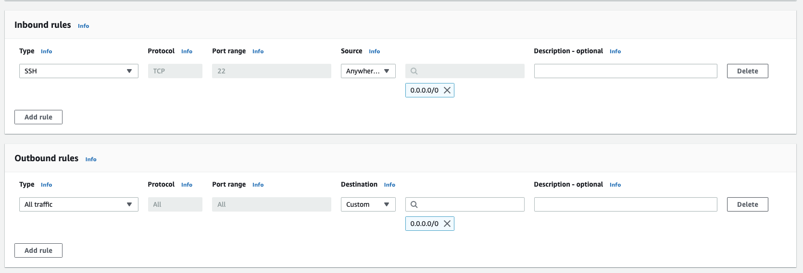
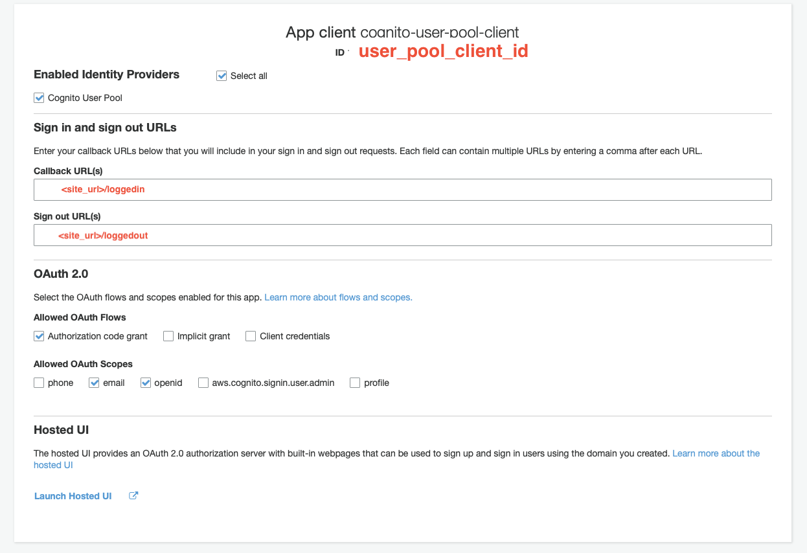
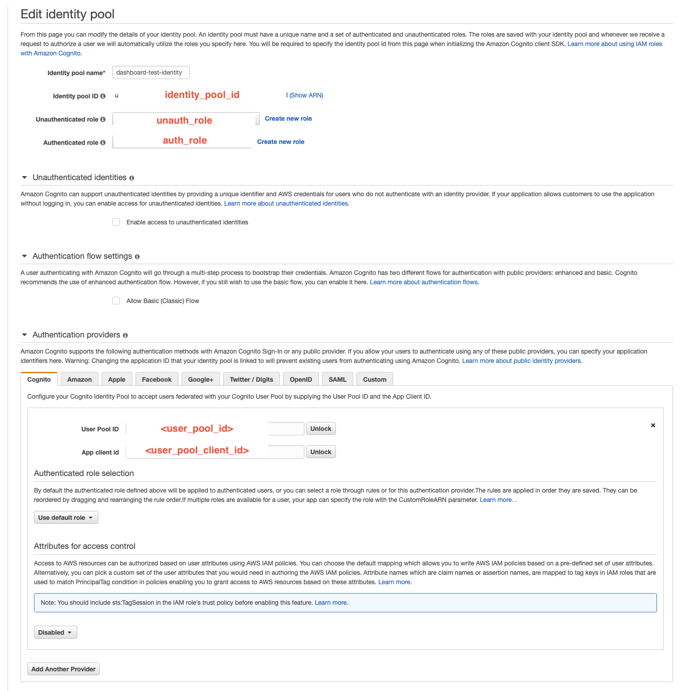
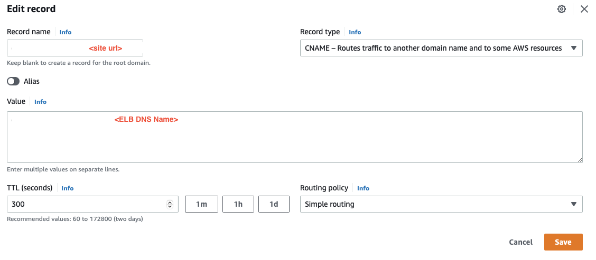

# Dashboard Deployment Instructions

Docker version with cloud

### 0. Local Preparation
   - Look through `dashboard-flask/docker-compose.yml` file and update the environment variables.
     * `APP_NAME` should match the name of the user pool (see step 1).
     * `REGION` is the AWS region of the dashboard (e.g. `us-east-1`)
     * `USER_POOL_ID` is the ID from the user pool created or existing (will be updated in Step 1.)
   - Create a Route 53 domain with AWS certificate. (This step may require an admin to set up)
     * Create a URL that will host the dashboard. For Goddard HelioCloud project, it is hsdcloud.org and the dashboard is hosted at http://dashboard.hsdcloud.org. The simplest option is to create one through Route 53 since it makes linking things to it much simpler on AWS. However, it can be any hosted domain. The following steps assume a Route 53 domain.
     * Update the `SITE_URL` with the name of the domain (e.g. `https://dashboard.hdscloud.org`). The domain **must** start with HTTPS.
     * Set up an AWS certificate for the domain name through AWS Certificate Manager.
     * Update `CertificateArn` in the `docker-compose.yml` file with the Certificate ARN.
   - Create default security group for all dashboard-launched EC2 instances.
     * Go to [AWS EC2](https://us-east-1.console.aws.amazon.com/ec2) >> Security Groups >> Create security group. 
     * Create a security group with the following inbound and outbound rules. This will allow EC2 users to access their instance via SSH.  
     * Update docker-compose environment variable `DEFAULT_SECURITY_GROUP_ID` with the ID of the created security group.
### 1. Set up Cognito services.
   - Either create or use an existing user pool. Create new user pool. If using exisiting user pool, skip to step c.
     1. Go to [AWS Cognito](https://us-east-1.console.aws.amazon.com/cognito) on console. Click on `Manage User Pools` >> `Create User Pool`.
     2. Set up with default settings. You may want to change the `Attributes` and `Policies` sections for increased security.
     3. Go to `App Clients` >> `Add an app client` and set up like the following. 
     4. You will need to set up a callback URL. This should be the same as your site URL. It must be https.
     5. From this page, retain the app client ID. Add this ID to your `secrets/user_pool_client_id.txt` file. Also, retain the user pool ID and add to `docker-compose.yml` as an environment variable.
   - Create an identity pool.
     1. Go to [AWS Cognito](https://us-east-1.console.aws.amazon.com/cognito) on console. Click on `Manage Identity Pools` >> `Create new identity Pool`.
     2. Set up identity like the following: 
     3. Retain the identity pool id and add to `secrets/identity_pool_id.txt`. Fill in user pool ID and app client ID with the new/existing user pool you are using.
     4. Unauthenticated and authenticated users will be assigned a role. Cognito will create a new role for you for each, or you can create your own. For unauthenticated role, the default is fine. However, the authenticated role should be changed to the permissions in `authenticated_role.yml`. Once the roles are created, make sure to connected to the unauth or auth role.
### 2. Create ECR repository and push up image.
   - Go to [AWS Elastic Container Reigstry](https://us-east-1.console.aws.amazon.com/ecr/repositories) and click "Create repository". You can choose to have it be private or public. Retain the repository URI and add to docker-compose.yml file under image.
   - View and perform the first push command for the ECR repository. It should look something like this: `aws ecr get-login-password --region <region> | docker login --username AWS --password-stdin <URI>`
   - On command line, run the following steps. This will first clear your cache of any old images, build your image locally, and push up to the ECR repository.
    ```
    docker system prune -a
    docker compose build
    docker compose push
    ```
### 3. Deploy container
   - Refresh environment variables with AWS access keys. Run the following commands with your variables.
   ```
    aws sts get-session-token --serial-number <your mfa arn> --token-code <your mfa token>
    export AWS_ACCESS_KEY_ID=<>
    export AWS_SECRET_ACCESS_KEY=<>
    export AWS_SESSION_TOKEN=<>
    export AWS_DEFAULT_REGION=<>
   ```
   - Create a new docker context for accessing AWS and choose "AWS environment variables". 
   ```
    docker context create ecs myecscontext
   ```
   - Switch to ECS docker context and deploy.
   ```
    docker compose up
   ```
   - You can monitor the deployment through [AWS Cloudformation](https://us-east-1.console.aws.amazon.com/cloudformation/). The stack will have the same name as the directory that the `docker-compose.yml` file is in (e.g. `dashboard-flask`). If deployment is successful, the status of the stack should eventually become "UPDATE_COMPLETE".
### 4. Finishing Touches
   - After the dashboard is deployed successfully, connect the Elastic Load Balancer to the site. Go to [AWS EC2](https://us-east-1.console.aws.amazon.com/ec2) >> Load Balancers. The load balancer will be named something like `dashb-***`. Retain the DNS name of the load balancer.
   - Create a hosted zone for the site URL. Go to [AWS Route 53](https://us-east-1.console.aws.amazon.com/route53/) >> Hosted zones. Then select the domain that the dashboard will be hosted on.
   - Select "Create Record" and set up the record like this: 
   - Test if everything worked by going to your site URL. It should forward to the AWS Cognito sign in page.
### Common pitfalls

### Tear down container
    - If you want to tear down the container, in the ECS context, run command `docker compose down`. That will rollback the cloud formation script and delete all resources.