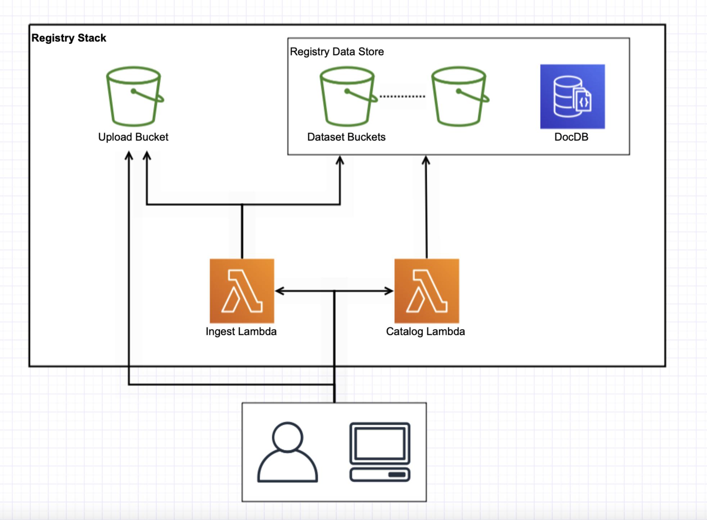

This folder contains the CDK stack definition for setting up the base data environment of a HelioCloud instance, consisting of:
- public S3 bucket creation with appropriate permissions for "requestor pays" access
- Lambdas for managing file registry within the public s3 bucket
- A file registry server that HelioCloud instances (including this and external ones) can query for information on datasets stored within this instance

The HelioCloud file registration service enables the storage and registration of heliophysics data sets within a HelioCloud instance. Installation prepares a public AWS S3 bucket for data set storage and configures a combination of AWS Lambdas and DocumentDB to act as the file registry pipeline and database.  A HAPI-like REST service is deployed as the interface to the reigstry, enabling internal and external processes (e.g. Jupyter Notebooks in this HelioCloud instance, or others) to inquirey as to what data sets are stored in this particulare HelioCloud instance. 

The **previous** sub directory contains the initial set of AWS Lambda scripts and DocumentDB setup used to register a set of MMS files in S3.  It is actively being picked apart to determine what code will be reused in developing the file registry.

